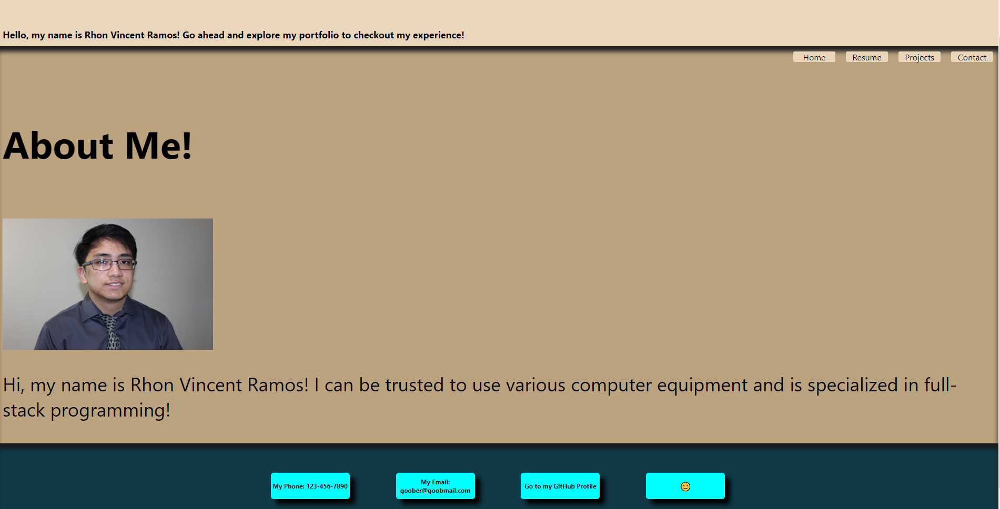

# Portfolio with React

## Description

This project is an overhaul of the original portfolio page but with React implementation instead of basic HTML, CSS, and JavaScript.

## Installation

Install this repository onto your machine. Inside an integrated terminal, run the commands "npm run build" then "npm run start" to display the completed project over a local server.

## Usage

The user can explore the various tabs and links provided by the project. All that is required is for them to click on the four tabs or the footer links as they please.

## Screenshot

